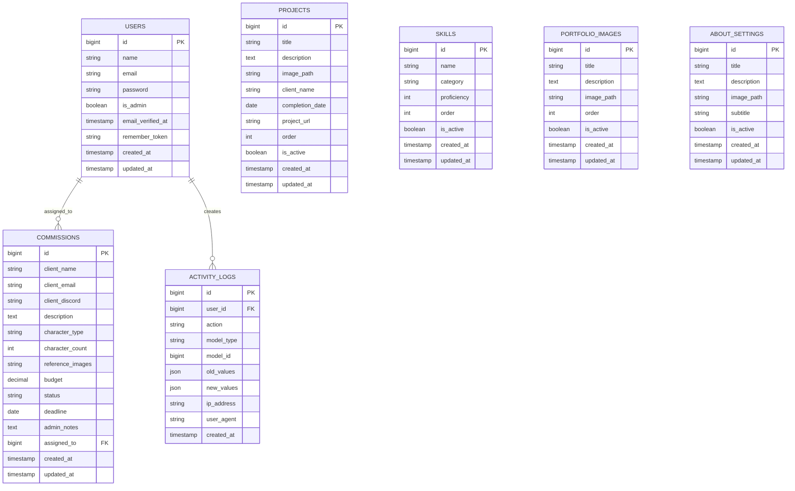

# Entity Relationship Diagram (ERD)

## Database Schema Overview

## Table Descriptions

### 1. users
**Purpose:** Stores user authentication and profile information

| Column | Type | Nullable | Default | Description |
|--------|------|----------|---------|-------------|
| id | BIGINT | No | Auto | Primary key |
| name | VARCHAR | No | - | User's full name |
| email | VARCHAR | No | Unique | User's email address |
| password | VARCHAR | No | - | Hashed password |
| is_admin | BOOLEAN | No | false | Admin role flag |
| email_verified_at | TIMESTAMP | Yes | null | Email verification timestamp |
| remember_token | VARCHAR | Yes | null | Remember me token |
| created_at | TIMESTAMP | Yes | now | Record creation time |
| updated_at | TIMESTAMP | Yes | now | Last update time |

**Indexes:**
- PRIMARY KEY (id)
- UNIQUE (email)

---

### 2. projects
**Purpose:** Stores portfolio project showcases

| Column | Type | Nullable | Default | Description |
|--------|------|----------|---------|-------------|
| id | BIGINT | No | Auto | Primary key |
| title | VARCHAR | No | - | Project title |
| description | TEXT | Yes | null | Project description |
| image_path | VARCHAR | Yes | null | Path to project image |
| client_name | VARCHAR | Yes | null | Client name (if applicable) |
| completion_date | DATE | Yes | null | Project completion date |
| project_url | VARCHAR | Yes | null | Live project URL |
| order | INT | No | 0 | Display order |
| is_active | BOOLEAN | No | true | Visibility flag |
| created_at | TIMESTAMP | Yes | now | Record creation time |
| updated_at | TIMESTAMP | Yes | now | Last update time |

**Indexes:**
- PRIMARY KEY (id)
- INDEX (is_active, order)

---

### 3. skills
**Purpose:** Stores technical skills and proficiency levels

| Column | Type | Nullable | Default | Description |
|--------|------|----------|---------|-------------|
| id | BIGINT | No | Auto | Primary key |
| name | VARCHAR | No | - | Skill name |
| category | VARCHAR | Yes | null | Skill category (e.g., 'Software', 'Technique') |
| proficiency | INT | No | 50 | Proficiency level (0-100) |
| order | INT | No | 0 | Display order |
| is_active | BOOLEAN | No | true | Visibility flag |
| created_at | TIMESTAMP | Yes | now | Record creation time |
| updated_at | TIMESTAMP | Yes | now | Last update time |

**Indexes:**
- PRIMARY KEY (id)
- INDEX (category, is_active)

---

### 4. commissions
**Purpose:** Stores commission/order requests from clients

| Column | Type | Nullable | Default | Description |
|--------|------|----------|---------|-------------|
| id | BIGINT | No | Auto | Primary key |
| client_name | VARCHAR | No | - | Client's name |
| client_email | VARCHAR | No | - | Client's email |
| client_discord | VARCHAR | Yes | null | Client's Discord username |
| description | TEXT | No | - | Commission description |
| character_type | VARCHAR | Yes | null | Art style/type |
| character_count | INT | No | 1 | Number of characters |
| reference_images | VARCHAR | Yes | null | JSON array of reference image paths |
| budget | DECIMAL(10,2) | Yes | null | Client's budget |
| status | VARCHAR | No | 'pending' | Commission status |
| deadline | DATE | Yes | null | Requested deadline |
| admin_notes | TEXT | Yes | null | Internal admin notes |
| assigned_to | BIGINT | Yes | null | FK to users.id |
| created_at | TIMESTAMP | Yes | now | Record creation time |
| updated_at | TIMESTAMP | Yes | now | Last update time |

**Status Values:**
- `pending` - Awaiting review
- `reviewing` - Under review
- `accepted` - Accepted by admin
- `in_progress` - Currently being worked on
- `completed` - Finished
- `cancelled` - Cancelled by client
- `rejected` - Rejected by admin

**Indexes:**
- PRIMARY KEY (id)
- INDEX (status, created_at)
- FOREIGN KEY (assigned_to) REFERENCES users(id) ON DELETE SET NULL

---

### 5. portfolio_images
**Purpose:** Stores portfolio image gallery items

| Column | Type | Nullable | Default | Description |
|--------|------|----------|---------|-------------|
| id | BIGINT | No | Auto | Primary key |
| title | VARCHAR | No | - | Image title |
| description | TEXT | Yes | null | Image description |
| image_path | VARCHAR | No | - | Path to image file |
| order | INT | No | 0 | Display order |
| is_active | BOOLEAN | No | true | Visibility flag |
| created_at | TIMESTAMP | Yes | now | Record creation time |
| updated_at | TIMESTAMP | Yes | now | Last update time |

**Indexes:**
- PRIMARY KEY (id)
- INDEX (is_active, order)

---

### 6. about_settings
**Purpose:** Stores configurable about page content

| Column | Type | Nullable | Default | Description |
|--------|------|----------|---------|-------------|
| id | BIGINT | No | Auto | Primary key |
| title | VARCHAR | No | - | Page title |
| description | TEXT | Yes | null | About description |
| image_path | VARCHAR | Yes | null | Profile/hero image path |
| subtitle | VARCHAR | Yes | null | Subtitle text |
| is_active | BOOLEAN | No | true | Visibility flag |
| created_at | TIMESTAMP | Yes | now | Record creation time |
| updated_at | TIMESTAMP | Yes | now | Last update time |

**Indexes:**
- PRIMARY KEY (id)

---

### 7. activity_logs (To be implemented)
**Purpose:** Audit trail for tracking all CRUD operations

| Column | Type | Nullable | Default | Description |
|--------|------|----------|---------|-------------|
| id | BIGINT | No | Auto | Primary key |
| user_id | BIGINT | Yes | null | FK to users.id (who performed action) |
| action | VARCHAR | No | - | Action performed (created, updated, deleted) |
| model_type | VARCHAR | No | - | Model class name |
| model_id | BIGINT | No | - | Model instance ID |
| old_values | JSON | Yes | null | Previous values (before update) |
| new_values | JSON | Yes | null | New values (after update) |
| ip_address | VARCHAR | Yes | null | User's IP address |
| user_agent | VARCHAR | Yes | null | User's browser user agent |
| created_at | TIMESTAMP | Yes | now | Action timestamp |

**Indexes:**
- PRIMARY KEY (id)
- INDEX (user_id, created_at)
- INDEX (model_type, model_id)
- FOREIGN KEY (user_id) REFERENCES users(id) ON DELETE SET NULL

---

## Relationships

### One-to-Many
- **User → Commissions**: An admin user can be assigned to multiple commissions
- **User → ActivityLogs**: A user creates multiple activity log entries

### Polymorphic (Future Enhancement)
- Activity logs can track changes to any model through `model_type` and `model_id`

---

## Business Rules

1. **Admin Access**: Only users with `is_admin = true` can access admin panel
2. **Commission Workflow**: pending → reviewing → accepted → in_progress → completed
3. **Soft Deletes**: Not implemented; use `is_active` flag for logical deletion
4. **Image Storage**: All images stored locally in `storage/app/public/`
5. **Order Display**: Items ordered by `order` column, then by `created_at DESC`
6. **Budget Tracking**: Commission budget stored as decimal with 2 precision
7. **Audit Trail**: All CRUD operations logged in activity_logs table

---

## Future Enhancements

1. Add `categories` table for project categorization
2. Add `tags` table with many-to-many relationship to projects
3. Add `messages` table for commission communication
4. Add `payments` table for commission payment tracking
5. Implement soft deletes for all main entities
6. Add `notifications` table for user notifications
